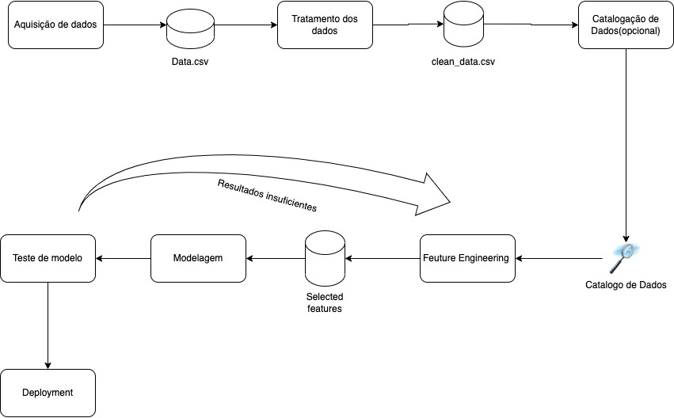

# Respostas do questinário do trabalho.

1- A solução criada nesse projeto deve ser disponibilizada em repositório git e disponibilizada em servidor de repositórios (Github (recomendado), Bitbucket ou Gitlab). O projeto deve obedecer o Framework TDSP da Microsoft. Todos os artefatos produzidos deverão conter informações referentes a esse projeto (não serão aceitos documentos vazios ou fora de contexto). Escreva o link para seu repositório. 

R: <https://github.com/walterpl/infnet_IA_course/tree/main/eng-ml>

2- Iremos desenvolver um preditor de arremessos usando duas abordagens (regressão e classificação) para prever se o "Black Mamba" (apelido de Kobe) acertou ou errou a cesta.
Para começar o desenvolvimento, desenhe um diagrama que demonstra todas as etapas necessárias em um projeto de inteligência artificial desde a aquisição de dados, passando pela criação dos modelos, indo até a operação do modelo.'

R: 

3- Descreva a importância de implementar pipelines de desenvolvimento e produção numa solução de aprendizado de máquinas.

R: Quando um projeto ja está em uso, eventualmente alguma atualização/
correção/bug/modificação se faz necessária, para garantir que 
o desenvolvimento do código futuro não afete o código presente,
o mesmo é desenvolvido de forma isolada do código em uso, que é chamado de produção.
O código em desenvolvimento é criado em um ambiente chamado de desenvolvimento, que normalmente
é um espelho do ambiente de produção, depois de desenvolvido e testado
o mesmo é entregue ao ambiente de produção, normalmente sem a 
percepção do usuário final.

4- Como as ferramentas Streamlit, MLFlow, PyCaret e Scikit-Learn auxiliam na construção dos pipelines 
descritos anteriormente? A resposta deve abranger os seguintes aspectos:

R: Todas as ferramentas auxiliam em diferentes partes durante a produção de uma solução IA, começando pelo **MLFlow**, que
é uma ferramente voltada para MLops, a qual nos permite manter o histórico de todos os modelos, seus parâmetros e seus 
resultados de treino, como nos permite testar as modelagens como diferentes funções de um pipeline, para garantir que
todo código da solução seja não apenas compilável, mas também funcional. **Scikit-Learn** é a ferramenta que possui diversos
modelos de ML incluse suas funções auxiliares para tratamentos de dados, e a partir dela que monta-se o modelo. **PyCaret** é
a ferramenta utilizada para construir, testar e escolher o melhor modelo no momento de teste, ela utiliza os recursos do
Scikit-Learn internamente para compilar os modelos e seus resultados são armazenados e catalogados no MLFlow. **StremLit** é a 
porta de saída do modelo para a produção, pois é a partir dele que o modelo deixará o ambiente de desenvolvimento e será enviado
ao ambiente de produção o tornando disponível via API.

5

6- 

A) Os dados devem estar localizados em "/Data/kobe_dataset.csv"

R: 

B) A variável shot_made_flag será seu alvo, onde 0 indica que Kobe errou e 1 que a cesta foi realizada. O dataset resultante 
será armazenado na pasta "/Data/processed/data_filtered.parquet". Ainda sobre essa seleção, qual a dimensão resultante 
do dataset?

R: 

C) Explique como a escolha de treino e teste afetam o resultado do modelo final. Quais estratégias ajudam a minimizar
os efeitos de viés de dados.

R: Partindo do pressuposto que a classe está desbalanceada, a separação da mesma diretamente pelo método 80|20 pode 
resultar é uma base de teste enviesada, onde a maioria dos dados pertencem a classe X, resultando em um modelo tendencioso a 
escolher a classe X como resultado, caso a base de teste seja oposta a precisão tenderá a ser baixa, o mesmo para o f1-score entretanto 
talvez o recall seja um pouco maior. Algumas estratégias podem ser adotadas para evitar o vies dos dados desbalanceados, o primeiro
é excluir os dados da classe de maior incidência, caso o resultado final não seja uma base curta, o segundo método seria
gerar valores sintéticos para a classe de menor incidência visando balancear a classe, também podemos excluir a feature caso
o peso dela no modelo seja baixo ou tenha alta correlação com outra feature balanceada e por ultimo a correlação cruzada 
pode amenizar os efeitos da base enviesada pois dividirá a mesma em multiplas partes, efetuará multiplos treinamentos 
testando essas partes menores umas contra as outras.

D) Registre os parâmetros (% teste) e métricas (tamanho de cada base) no MlFlow

R: 

7- 
A e B)

c) Com os dados separados para treinamento, treine um modelo de classificação do sklearn usando a biblioteca pyCaret. 
A escolha do algoritmo de classificação é livre. Justifique sua escolha.

R: Continuando a utilizar a lib Pycarret, após testar todos os modelos uns contra os outros e utilizar o auto-tunning,
o modelo com melhor resultado foi o Gradient Boosting classifier.

D)  Registre a função custo "log loss" e F1_score para esse novo modelo.

R: 

8- 